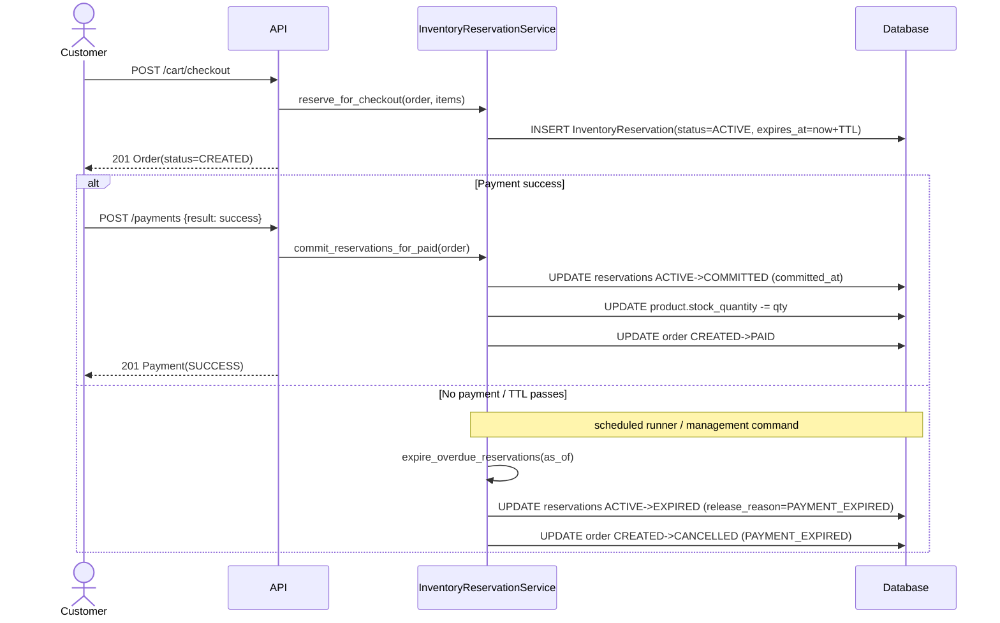

# Inventory Reservation TTL Lifecycle

## Purpose

Shopwise separates **holding stock** (reservation) from **physical stock decrement** (commit) to prevent overselling and to stay WMS-friendly. `Product.stock_quantity` represents **physical stock**. Availability for reservation is computed as:

`available = stock_quantity - sum(ACTIVE reservations for product)`

This policy is defined in ADR-025.

## Where TTL is applied

TTL is applied at **checkout time** when ACTIVE reservations are created. Each reservation stores an explicit `expires_at` timestamp.

TTL values are configurable via environment variables:

- `RESERVATION_TTL_GUEST_SECONDS` (default 900 = 15 min)
- `RESERVATION_TTL_AUTH_SECONDS` (default 7200 = 2 h)

## Expiration runner (background job / management command)

Reservation expiration is handled by a scheduled runner (later: django-q2 job). The runner:

- finds reservations with `status=ACTIVE` and `expires_at < as_of_time`
- applies only if the associated order is still `CREATED`
- transitions reservations to terminal state `EXPIRED` (treated as release with reason `PAYMENT_EXPIRED`)
- cancels the order with cancellation metadata (`cancel_reason=PAYMENT_EXPIRED`, `cancelled_by=SYSTEM`)

Paid orders are not affected: after payment success, reservations are `COMMITTED` and the order becomes `PAID`.

## Sequence diagram

## Operational Notes

- The expiration runner uses `as_of` as a cutoff time: a reservation is overdue if `expires_at < as_of`.

`--dry-run` (CLI) is a read-only estimate and intentionally avoids locks to minimize operational impact.
