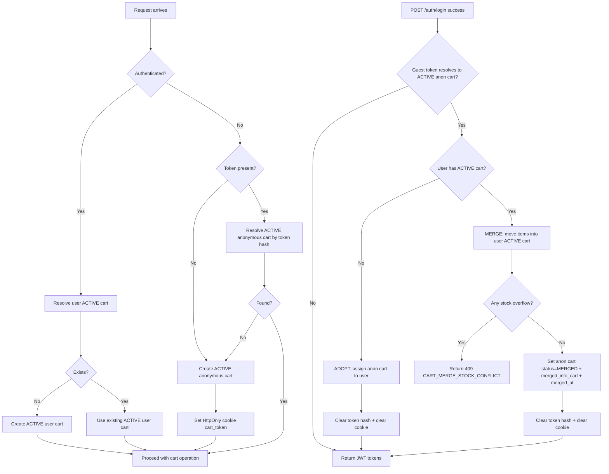

# ADR-022: Anonymous Cart Introduction

**Status**: Proposed

**Date**: Sprint 8

**Decision type**: Architecure

## Context

Shopwise supports a shopping flow where users can add items to a cart before authentication.
We need a robust Anonymous Cart mechanism that:

- works seamlessly for browser users (realistic guest experience),
- is deterministic and testable in API-level E2E tests (Postman, CI),
- supports merging an anonymous cart into an authenticated user's cart on login,
- avoids duplication, supports idempotency, and handles concurrency safely (MySQL).

## Relationship to ADR-018

- [ADR-018](../decisions/ADR-018-Anonymous-Cart-and-Cart-Merge-on-Login.md) defines the **business merge policy** (adopt vs merge rules, quantity summation, conflict conditions).
- ADR-022 defines the **anonymous cart identification, token transport, request resolution, and token invalidation mechanics**.
- ADR-022 does not redefine merge policy details beyond what is needed to implement correct token handling.

## Goals

1. Allow guest users to create and modify a cart without authentication.
2. Persist a guest cart across multiple requests using an opaque token.
3. On login, adopt or merge the anonymous cart into the user's active cart.
4. Enforce business rules for merge conflicts (stock overflow).
5. Ensure idempotency: repeated login with the same token must not duplicate items.
6. Keep consistent error response shape: `{code, message}` (+ `{errors}` for validation).

## Non-Goals

- Frontend implementation details (handled later in Next.js).
- Full reservation/fulfillment logic (separate ADR / later in Sprint 8).
- Cookie consent / long-term user tracking (out of scope).

## Decision

### D1 — Anonymous Cart Identification

Anonymous carts are identified by an **opaque token** (guest cart token).

- The backend generates the token when needed.
- The backend stores only a **SHA-256 hash** of the token in the database (`anonymous_token_hash`), never the raw token.

**Rationale:** If the DB leaks, raw tokens would allow unauthorized cart access. Hash storage reduces exposure.

### D2 — Token Transport

The token is transported by the client in one of two ways:

1. **Primary (browser UX):** HTTP-only cookie `cart_token`
2. **Secondary (testing/debug/CI):** request header `X-Cart-Token`

Precedence rule:

- If both are present, **`X-Cart-Token` takes precedence** over the cookie.

Cookie attributes (production defaults):

- `HttpOnly`
- `SameSite=Lax`
- `Secure` (enabled in production HTTPS environments)

**Rationale:** Cookie provides realistic browser behavior; header provides deterministic test flows for Postman/CI.

### D3 — Cart Resolution Rules

For each request:

- If user is authenticated:
  - Return or create the user's **ACTIVE** cart (`GET /api/v1/cart/` keeps existing behavior: lazily creates ACTIVE cart if missing).
- If user is not authenticated:
  - Resolve an anonymous cart by token:
    - If token exists and matches an ACTIVE anonymous cart → return it.
    - If token missing or invalid → create new ACTIVE anonymous cart and return it (and set cookie).

### D4 — Merge / Adopt Policy on Login

On successful login, if a guest token resolves to an ACTIVE anonymous cart, the backend applies the adopt/merge policy defined in [ADR-018](../decisions/ADR-018-Anonymous-Cart-and-Cart-Merge-on-Login.md).

ADR-022 specifies only the required mechanics: how the guest cart is identified, how token invalidation is handled, and how request resolution behaves before/after login.

### D5 — Token Invalidation, Audit, and Idempotency

After login, token invalidation is required to prevent double-merge and ensure idempotency.

#### Adoption (user has no ACTIVE cart)

- The anonymous cart becomes the user's ACTIVE cart:
  - `cart.user = <user>`
  - `cart.status` remains `ACTIVE`
- Token is invalidated:
  - `anonymous_token_hash = NULL`
  - client cookie is cleared (`Set-Cookie cart_token=; Max-Age=0`)
- `merged_into_cart` MUST remain `NULL` (adopt is not a merge)

#### Merge (user already has an ACTIVE cart)

- The user's cart remains `ACTIVE` and receives merged items.
- The anonymous cart transitions to terminal MERGED state:
  - `anonymous_token_hash = NULL`
  - `status = MERGED`
  - `merged_into_cart = <user_active_cart>`
  - `merged_at = now()`
  - client cookie is cleared

#### Idempotency rule

- Once a token has been invalidated (`anonymous_token_hash = NULL`), reusing that token MUST NOT alter any cart state or duplicate items.
- The system may respond with 401/404, or it may create a new empty anonymous cart, but it must be safe and non-mutating.

### D6 — Cart Status Model

Cart statuses are:

- `ACTIVE` — current cart that can be modified (user or anonymous)
- `CONVERTED` — checkout completed; cart converted to order (existing)
- `MERGED` — terminal state for an anonymous cart that was merged into a user's cart; never returned as "current cart"

Invariants:

- Only `ACTIVE` carts may be resolved as the current cart.
- `CONVERTED` and `MERGED` carts are terminal and must never be selected as the current cart.
- Merge/adopt logic must never mutate a `CONVERTED` cart.

## Data Model Changes

Cart table additions (names may align with existing naming conventions):

- `anonymous_token_hash` (nullable, unique, indexed)
- `merged_into_cart_id` (nullable FK to Cart)
- `merged_at` (nullable datetime)
- `status = MERGED`

Constraints/invariants:

- One token hash identifies at most one ACTIVE anonymous cart (enforced by UNIQUE).
- Only ACTIVE carts participate as merge targets.
- CONVERTED carts are never merge targets.

## API Behavior

### Endpoints impacted

- `GET /api/v1/cart/`
  - Authenticated: return/create user's ACTIVE cart
  - Anonymous: return/create anonymous cart by token
- Cart item endpoints (e.g., `POST /api/v1/cart/items/`, `PATCH`, `DELETE`)
  - Must work for both anonymous and authenticated users using the same resolution rules
- `POST /api/v1/auth/login/`
  - After successful auth, execute adopt/merge if guest token present
  - On merge conflict return 409 with unified error shape

### Error Contract

409 merge conflict:

```json
{
  "code": "CART_MERGE_STOCK_CONFLICT",
  "message": "Merging carts would exceed available stock for one or more products."
}
```

### OpenAPI Documentation Requirements

OpenAPI must document:

- Optional request header: `X-Cart-Token`
- Response may include `Set-Cookie: cart_token=...` when an anonymous cart is created
- Response may include `Set-Cookie: cart_token=; Max-Age=0` when the token is cleared after adopt/merge

## Concurrency & MySQL Considerations

To prevent double-merge and ensure correctness under concurrent logins:

- Resolve guest cart by token hash using row-level locking where appropriate:
- `select_for_update()` on the anonymous cart row during merge/adopt
- Merge/adopt and token invalidation must be executed atomically in a transaction.
- Unique constraint on `anonymous_token_hash` must be validated on MySQL.

MySQL-specific tests are required for:

- enforcing UNIQUE constraint behavior,
- idempotency under sequential token reuse,
- ensuring CONVERTED carts are not merge targets,
- preventing duplication when token is processed multiple times.

## Operational Considerations (TTL / Cleanup)

Anonymous carts may be periodically cleaned up (TTL-based) to reduce database growth.
TTL policy and cleanup job/command are out of scope for this ADR and may be introduced later as an operational improvement.

## Implementation Outline (Non-Normative)

### CartResolver Service (single source of truth)

Create a dedicated module, e.g. `carts/services/resolver.py`:

- `extract_cart_token(request) -> Optional[str]` (header first, then cookie)
- `resolve_cart(request) -> (Cart, Optional[str])`
  - returns the resolved cart
  - optionally returns a new token that should be set as cookie

### Merge/Adopt Hook in Auth Service

On login success:

- call `merge_or_adopt_guest_cart(user, token)` in a transaction
- lock the anonymous cart row via `select_for_update()` to prevent double processing

### Cookie Handling (optional but recommended)

Prefer centralizing cookie set/clear logic:

- On new anonymous cart creation → add `Set-Cookie cart_token=...`
- On adopt/merge → add `Set-Cookie cart_token=; Max-Age=0`
  This avoids scattering cookie logic across multiple views.

## Testing Strategy

- Pytest (SQLite): functional behavior and core invariants
- Pytest (MySQL, @pytest.mark.mysql): constraints, idempotency, concurrency-sensitive cases
- Postman: cross-request flow validation
  - Guest cart creation/persistence
  - Guest → register → login (adopt)
  - Guest → login (merge)
  - 409 conflict on stock overflow
  - Token invalidation / non-duplication

## Flow Diagram



## Alternatives Considered

### A1 — Session-only anonymous carts (server session id)

Rejected:

- harder to test deterministically in Postman/CI,
- less portable across clients,
- complicates API usage outside a browser context.

### A2 — Store raw token in DB

Rejected:

- higher risk if DB is leaked,
- unnecessary since hash lookup is sufficient.

### A3 — Header-only token

Rejected:

- worse browser UX (frontend must manage storage),
- higher risk if stored in JS-accessible storage,
- cookie provides safer defaults with HttpOnly.

## Consequences

**Positive**

- Realistic guest UX with secure defaults.
- Deterministic API tests (Postman/CI) via explicit header.
- Clear merge rules and explicit conflict behavior.
- Reduced security risk by storing only hashed token.

**Negative / Trade-offs**

- Extra complexity in request resolution layer.
- Need to document token behavior clearly in OpenAPI.
- Must ensure proper transaction handling for MySQL concurrency.

## References

- [Postman Anonymous Cart Testing](../architecture/Postman%20Anonymous%20Cart%20Testing.md)
- [Current Architecture Baseline](../architecture/Current%20Architecture%20Baseline.md)
- Sprint 8: Auth + Anonymous Cart + Fulfillment roadmap
