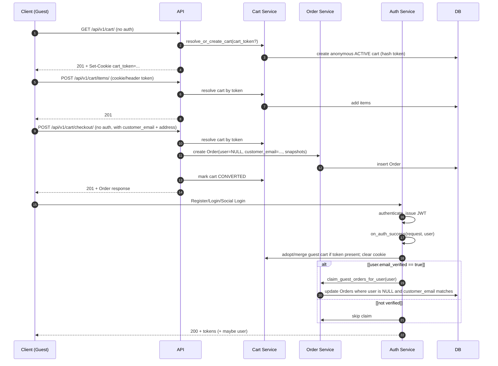

# ADR-023: Guest Checkout and Verified Claim of Guest Orders

**Status**: Accepted

**Date**: Sprint 8

**Decision type**: Architecure

**Related ADRs**:

- [ADR-022](ADR-022-Anonymous_Cart_Introduction.md): Anonymous Cart identification + transport + request resolution (cookie/header)
- [ADR-018](ADR-018-Anonymous-Cart-and-Cart-Merge-on-Login.md): Cart merge policy on login

## Context

Shopwise currently supports:

- Authenticated checkout flow and JWT authentication.
- Anonymous carts identified via `cart_token` (HTTP-only cookie; optional `X-Cart-Token` header).
- Cart merge/adopt on login.

However, the current UX requires registration/login to complete the end-to-end purchase flow. In modern e-commerce, **guest checkout** is a common business practice to improve conversion by reducing friction. We also want the system to support **claiming guest orders into a user account**, but only after **email verification** (double opt-in) to prevent account takeover of another person’s purchase history.

Additionally, we want to keep the architecture ready for:

- Social login (multiple authentication methods yielding a verified user)
- Future audit logging around order lifecycle and ownership changes

## Decision

### D1 — Introduce Guest Checkout on existing checkout endpoint

The endpoint `POST /api/v1/cart/checkout/` will support anonymous and authenticated clients.

- Anonymous checkout is allowed when the request provides required customer contact details (minimum: `customer_email`) and required address/contact fields introduced in this ADR.
- The checkout flow will create an `Order` even when `user = NULL`.

### D2 — Store customer/contact snapshots on Order

We will extend the Order domain model to include:

- `customer_email` (required; indexed)
- shipping/billing snapshot fields (minimal MVP set; see Domain & DB section)
- optional metadata fields to support auditability (e.g., `claimed_at`, `claimed_by`, etc.)

This ensures orders remain self-contained and auditable even if the user account changes or is deleted.

### D3 — Verified claim policy for guest orders

Guest orders must **not** be automatically attached to an account on registration/login unless the user’s email is verified.

- Claim eligibility requires `user.email_verified == True`.
- Claim operation attaches orders where:
  - `order.user IS NULL`
  - `order.customer_email` matches user’s email (case-insensitive)
  - optionally: additional verification flags (non-goal for MVP)

Claim will be performed via a single idempotent service function invoked from the auth layer when:

- Register completes with auto-login (user created)
- Login completes (password login)
- Social login completes (OAuth callback / identity provider)¨

#### Claim trigger semantics

Guest order claiming is triggered in the following situations:

1. **On authentication success**, if the user account already has `email_verified = true`
   (e.g. returning verified user login, social login with verified email).

2. **On email verification event**, when a user’s `email_verified` flag transitions from
   `false` to `true`.

Both triggers invoke the same idempotent claim operation.

### D4 — “Auth success hook” as integration point

We introduce a single orchestration point called after successful authentication:

`on_auth_success(request, user)`

Responsibilities:

- Merge/adopt guest cart if a cart token is present (ADR-022 + ADR-018).
- Clear guest cart cookie after adopt/merge.
- If `user.email_verified` is true: claim eligible guest orders.

This keeps the system ready for social login (any auth method calls the same hook).

The authentication layer acts only as an orchestration point.

All business logic for guest cart merge/adoption and guest order claiming is implemented in dedicated, idempotent service functions and executed transactionally.

### D5 — Audit readiness

Ownership changes (guest → user) and fulfillment-related changes are audit-relevant. We will prepare for audit logging by:

- Maintaining explicit order ownership fields (`user`, `customer_email`) and timestamps (e.g., `claimed_at`)
- Ensuring claim is transactional and idempotent
- Optionally adding an `OrderEvent`/`AuditLog` model later (non-goal for this ADR, but accounted for)

## Flow

### Guest checkout and later verified claim

## Consequences

**Positive**

- Supports real-world e-commerce conversion practice: guest checkout.
- Orders remain auditable with contact snapshots even without a user.
- Claiming guest orders is secure due to email verification requirement.
- Social login readiness via unified auth-success hook.
- Cleaner separation of concerns: cart domain vs order domain vs auth orchestration.

**Negative / Trade-offs**

- Requires additional data fields and validation on checkout.
  -Adds email verification workflow dependency for claim (must exist or be implemented).
- More test surface area (guest checkout + verified claim paths).

**Claim idempotence guarantees**

Guest order claiming is idempotent.

An order is eligible for claiming only if:

- `order.user IS NULL`
- `order.customer_email_normalized == user.email_normalized`
- `user.email_verified == true`

Once claimed, the order is marked as claimed and will not be re-processed on subsequent claim attempts.

**Non-goals**

- Implementing full audit logging system in this ADR (but design is audit-ready).
- Implementing social login itself (only providing a stable integration point).
- Advanced fraud prevention (beyond email verification).

## Testing Strategy

- API tests (SQLite): guest checkout, authenticated checkout, no-claim when unverified, claim when verified.
- MySQL suite: transactional idempotency tests for claim and cart merge/adopt, unique constraints.
- Postman flows: guest checkout end-to-end + register/login and verify claim behavior.
- Tests must verify that guest order claiming is triggered both on authentication and on email verification, and that the operation is idempotent.
